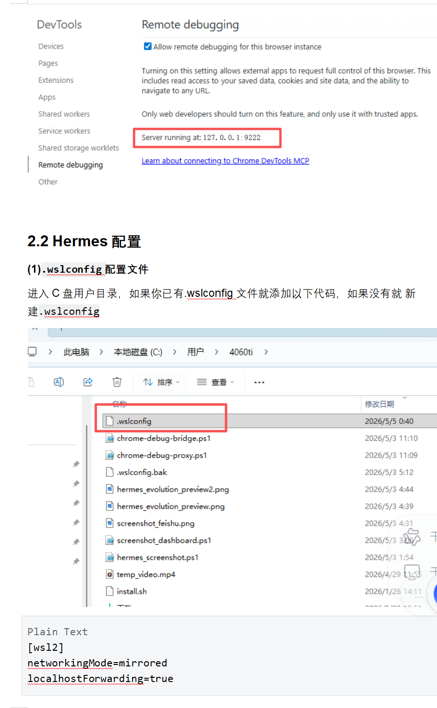
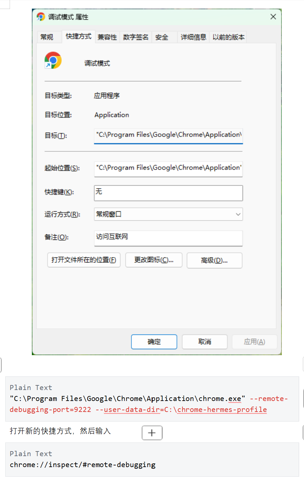

# 浏览器自动化设置与实测记录

> 2026-07-02 实测 | 环境：WSL2 + Windows Chrome

---

> 📌 浏览器自动化用于弥补需要付费、且没有自带自动化的工具的场景，用自带的免费方案替代。

## 一、两套工具对比结论

| 维度 | `browser_*` | `mcp_chrome_devtools_*` |
|------|-------------|------------------------|
| **WSL 可用性** | ❌ 直接崩溃 | ✅ 稳定可用 |
| **原理** | 自行启动 Chrome 进程 | 连接 Windows 已有 Chrome 实例 |
| **元素定位** | `@eN` 无障碍树引用 | `uid` 无障碍树引用 |
| **功能覆盖** | 导航/点击/输入/截图 | 全部 + 多标签/网络请求/性能/表单/文件上传 |
| **推荐度** | ❌ 不用 | ✅ 唯一可用方案 |

**`browser_*` 崩溃原因：** 在 WSL 里自行启动 Chrome 进程，WSL 内没有 Chrome 可执行文件。
错误信息：`Chrome exited early (exit code: 0) without writing DevToolsActivePort`

---

## 二、Chrome 调试模式设置（Windows 端）

### 2.1 创建快捷方式

**前提：Chrome 版本 > 144**

#### 步骤

1. 桌面（或任意位置）右键 → 新建 → 快捷方式
2. 指向 Chrome 的 `chrome.exe`，命名为"调试模式"
3. 右键新建的快捷方式 → **属性** → **快捷方式** 选项卡
4. 找到 **目标(T)** 字段，修改为：

```
"C:\Program Files\Google\Chrome\Application\chrome.exe" --remote-debugging-port=9222 --user-data-dir=C:\chrome-hermes-profile
```

5. 点击 **应用** → **确定**

#### ⚠️ 关键步骤：修改"目标"字段（最容易遗漏！）

这是整个配置中最关键也最容易踩坑的一步。下面是操作前后对比：

**修改前（原始状态）：** 目标字段只有 Chrome 可执行文件路径，没有参数



**修改方法：** 在路径末尾（引号外）加上两个参数 `--remote-debugging-port=9222 --user-data-dir=C:\chrome-hermes-profile`



> 💡 **踩坑记录：** 实测时我一开始没有注意到需要到这个属性对话框里修改"目标"字段，直接跳到了下一步，导致 Chrome 没有以调试模式启动。这一步必须手动打开属性窗口，在"目标"输入框里追加参数。

**参数说明：**
- `--remote-debugging-port=9222` — 开启 Chrome DevTools Protocol，让外部工具（Hermes）能控制浏览器
- `--user-data-dir=C:\chrome-hermes-profile` — 独立配置目录，不污染日常 Chrome 的用户数据

> 注：原文档使用的是 `C:\chrome-hermes-profile` 作为独立配置目录。WSL2 环境下还需在 `.wslconfig` 中配置网络（见下文 2.3），镜像网络模式下无需加 `--remote-debugging-address=0.0.0.0`。

### 2.2 开机自启

复制快捷方式到 Windows 启动文件夹：
```
/mnt/c/Users/amu/AppData/Roaming/Microsoft/Windows/Start Menu/Programs/Startup/
```

### 2.3 配置 `.wslconfig`（关键！让 WSL2 共享 Windows 网络）

进入 C 盘用户目录 `C:\Users\<你的用户名>\`，新建或编辑 `.wslconfig` 文件，添加：

```ini
[wsl2]
networkingMode=mirrored
localhostForwarding=true
```

**这个配置的作用：**
- `networkingMode=mirrored` — WSL2 使用 Windows 的镜像网络模式，不再隔离
- `localhostForwarding=true` — WSL2 的 `localhost` 直接转发到 Windows 的 `localhost`

配完 `.wslconfig` 后，**必须重启 WSL** 才生效：

```bash
# 在 Windows 命令行（PowerShell/CMD）中执行：
wsl --shutdown
```

> ⚠️ **对比两种方案：**
> | 方案 | 做法 | 优缺点 |
> |------|------|--------|
> | `.wslconfig` 镜像网络 | 改 `C:\Users\用户名\.wslconfig` | ⭐⭐⭐ 推荐，WSL 的 localhost 直接指向 Windows，无需额外参数 |
> | `--remote-debugging-address=0.0.0.0` | Chrome 监听所有网卡 | ⭐⭐ 可用，但 Chrome 暴露到公网，安全隐患 |

### 2.4 在 Hermes 中配置 Chrome MCP

打开 Hermes，在 `~/.hermes/config.yaml` 里加 MCP 服务器配置：

```yaml
mcp_servers:
  chrome-devtools:
    command: npx
    args:
    - -y
    - chrome-devtools-mcp@latest
    - --browser-url
    - http://127.0.0.1:9222
```

配置完后**重启 Hermes**。

> ⚠️ **重要提醒：刚才新建的 Chrome 调试模式快捷方式一定要先打开，否则找不到 MCP 服务！**

### 2.5 测试

在 Hermes 中发送：
```
使用 Chrome MCP 打开 www.baidu.com
```

预期响应：
```
百度已打开，页面加载正常。搜索框已聚焦，可以直接输入关键词搜索。
```

如果成功说明整个链路通了：Hermes → MCP Server → Chrome DevTools → 浏览器

### 2.6 验证连通性（备用方案）

```bash
# 测试端口是否通（mirrored 模式下应该直接通）
timeout 3 bash -c 'echo > /dev/tcp/localhost/9222' && echo "通" || echo "不通"
```

---

## 三、mcp_chrome_devtools_* 实测记录

### 3.1 成功操作

- ✅ 导航百度、汽车之家等网站
- ✅ 通过 `evaluate_script` 注入 JS 提取页面数据
- ✅ `take_snapshot` 获取无障碍树
- ✅ `take_screenshot` 截图
- ✅ 点击、填写表单等交互

### 3.2 踩过的坑

| 坑 | 表现 | 解决 |
|----|------|------|
| JS 语法报错 | `Error: missing ) after argument list` | JS 字符串中的引号被工具转义，避免在 function 里用单引号或转义字符 |
| 参数名拼写错误 | `Input validation error: Invalid arguments` | 工具参数名必须精确，如 `function` 不能写错 |
| 页面导航超时 | `Navigation timeout of 10000 ms exceeded` | 页面标题已变说明实际已加载，直接 `evaluate_script` 即可 |
| 前端路由筛选失效 | 汽车之家 `ev_0=1` 没过滤新能源 | Hash 路由参数不传后端，需换独立筛选页或直接 JS 过滤 |
| 403/503 反爬 | 有驾 403、太平洋 503 | 换汽车之家（autohome.com.cn）最稳定 |
| 懂车帝要求登录 | 跳转 login-required | 不用懂车帝 |

### 3.3 实操流程（标准步骤）

```
1. mcp_chrome_devtools_navigate_page(url="目标网址")
2. mcp_chrome_devtools_take_snapshot()        # 获取页面结构
3. mcp_chrome_devtools_evaluate_script()       # JS 注入提取数据
4. （可选）mcp_chrome_devtools_click()         # 点击翻页/展开
5. （可选）mcp_chrome_devtools_take_screenshot() # 视觉验证
```

### 3.4 evaluate_script 最佳实践

```javascript
() => {
  // 1. 优先用 document.querySelector 找容器
  const container = document.querySelector('#content_left, .main-content');
  
  // 2. 用 querySelectorAll 遍历列表项
  const items = container.querySelectorAll('.item, li, [class*="result"]');
  
  // 3. 从每个 item 提取标题、价格、描述
  items.forEach(item => {
    const title = item.querySelector('.title, h3, h4')?.textContent?.trim();
    const price = item.querySelector('.price, .amount')?.textContent?.trim();
    // ...
  });
  
  // 4. 如果结构化提取失败，fallback 到 innerText
  return { data: results, fallback: document.body.innerText.substring(0, 3000) };
}
```

---

## 四、实测数据（15万左右新能源汽车）

从汽车之家抓取的 15 万区间新能源车：

| 车型 | 价格 | 类型 | 备注 |
|------|------|------|------|
| 银河E8 | 14.98-19.88万 | 轿车（吉利） | — |
| 钛3 | 13.38-17.78万 | 轿车（东风奕派） | — |
| 华境S | 15.98-20.38万 | 大型SUV | 大型SUV销量第8名 |
| smart精灵#3 | 16.49-25.99万 | 小型SUV | — |
| 铂智7 | 16.98-22.98万 | 轿车（丰田bZ） | 20-25万紧凑型SUV销量第2名 |

> ⚠️ 数据是未过滤全量中筛选的，非精准排行榜。汽车之家 hash 路由导致筛选参数没传到后端。精准排行建议换易车/太平洋的独立新能源频道。

---

## 五、最佳数据源排名

| 站点 | 可达性 | 数据质量 | 备注 |
|------|--------|---------|------|
| autohome.com.cn | ✅ 稳定 | ⭐⭐⭐ 一般 | 筛选靠 JS 前端，需手动过滤 |
| baidu.com | ✅ 稳定 | ⭐⭐ 只有链接标题 | 搜索入口，需二次跳转 |
| dongchedi.com | ❌ 需登录 | — | 跳过 |
| youxia.com | ❌ 403 | — | 跳过 |
| pcauto.com.cn | ❌ 503 | — | 跳过 |

**结论：当前环境下汽车之家最靠谱，虽然筛选不完美但可以 JS 后处理。**

---

## 六、故障排查清单

- [ ] Chrome 调试模式快捷方式是否已打开？（**必须先打开，否则找不到 MCP 服务**）
- [ ] Chrome 版本是否 > 144？
- [ ] `.wslconfig` 是否已配置 `networkingMode=mirrored`？
- [ ] 修改 `.wslconfig` 后是否执行了 `wsl --shutdown` 重启 WSL？
- [ ] `~/.hermes/config.yaml` 中的 MCP 服务器配置是否正确？
- [ ] 配置完 `config.yaml` 后是否重启了 Hermes？
- [ ] WSL2 能否连通 Chrome？`timeout 3 bash -c 'echo > /dev/tcp/localhost/9222'`
- [ ] 防火墙是否放行 9222 端口？
- [ ] `evaluate_script` 语法是否合法（避免引号嵌套问题）？

---

> 📌 核心教训：**WSL 环境下只用 `mcp_chrome_devtools_*`，`browser_*` 直接放弃。**
